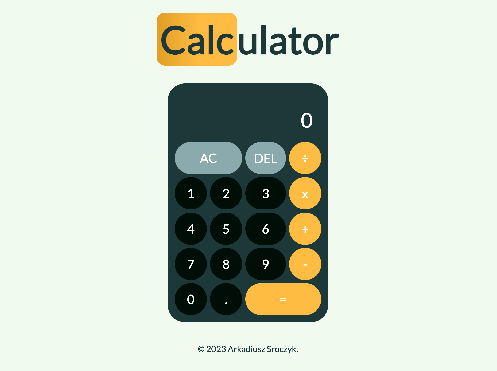

## Project Overview

Just a simple react calculator to practice and consolidate my knowledge of React and static typing with TypeScript :)

## Features

- Add, delete, multiply, divide
- Nice UI

## Tech Stack

- **React**
- **TypeScript**
- **CSS**

## Optimization

There is no need for optimization :)

## Live

https://arc4dev.github.io/react-calculator/
